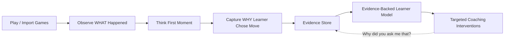
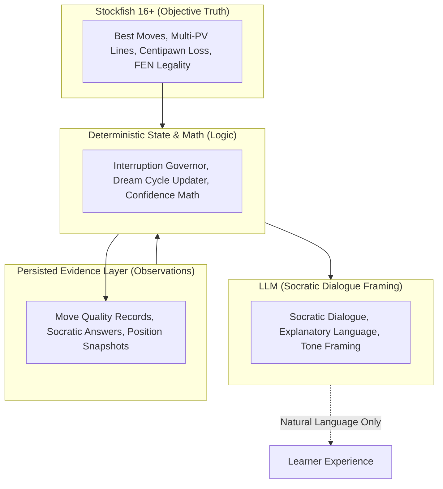
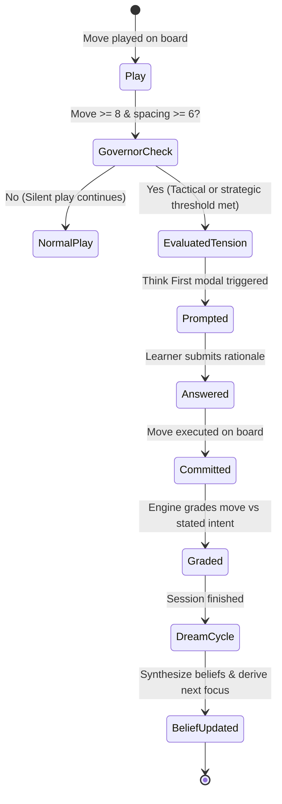

# Dr. Wolf Brain

> An evidence-backed memory layer for chess coaching.

Dr. Wolf already understands the board.  
This prototype explores what it would take for him to understand the learner.

- **Imported games** tell the coach **WHAT** happened on the board.
- **Think First moments** reveal **WHY** the learner made a decision.
- **The learner model** only makes claims strictly supported by persisted evidence.

> *Independent proof-of-work prototype exploring the future of personalized chess learning. Not affiliated with or endorsed by Chess.com.*

---

## 🌐 Public Live Deployments

- **Frontend (Vercel)**: [https://dr-wolf-brain.vercel.app](https://dr-wolf-brain.vercel.app)
- **Backend (Render)**: [https://dr-wolf-brain-api.onrender.com](https://dr-wolf-brain-api.onrender.com)
- **API Health Check**: [https://dr-wolf-brain.vercel.app/api/health](https://dr-wolf-brain.vercel.app/api/health)

---

## 💡 Why I Built This

### The Product Problem
A standard chess engine can easily spot a blunder, but the same mistake can stem from radically different cognitive failures:
1. **Perception Failure**: *I never saw the opponent's threat.*
2. **Calculation Failure**: *I saw the threat, but only calculated a single candidate reply.*
3. **Execution Failure**: *I understood the strategic goal, but chose the wrong move order.*
4. **False Positive / Fluke**: *I played the engine-approved move for completely the wrong reason.*

A traditional chess bot treats all four learners identically: by showing the engine eval and the computer line. But these learners need completely different coaching interventions.

### The Product Bet
Instead of prompting an LLM to generate generic chess advice, **Dr. Wolf Brain** explores whether a coach can build a durable, evidence-backed model of how a student reasons over time.

```
"Remembering the player is easy.
 Knowing what deserves to become a belief about the player is the hard part."
```

---

## 🔄 Core Product & Architecture Diagrams

### 1. The Product Loop
How learner actions translate into durable coaching intelligence:



### 2. Architectural Authority & Trust Boundaries
To eliminate LLM hallucinations and preserve chess/pedagogical integrity:



### 3. Think First Interruption Lifecycle
A server-authoritative state machine that intercepts critical learning moments:



---

## ⚖️ Key Product Decisions

1. **No Chat-History Memory**: Durable learner beliefs require structured, falsifiable evidence tuples, not conversational context stuffing.
2. **No Live Eval Bar During Think First**: Real-time evaluation bars leak move quality, anchoring the learner and corrupting their natural decision process.
3. **No LLM Mastery Scoring**: Language models explain evidence in human terms, but deterministic algorithms calculate concept mastery and decay.
4. **Imported Games Cannot Confirm Cognitive Hypotheses**: PGN imports show *what* was played (factual quality); only interactive Think First moments reveal *why* (cognitive intent).
5. **Disciplined MVP Scope**: Rather than cloning all of Dr. Wolf, this prototype validates one fundamental hypothesis: *can a coach learn one defensible, evidence-backed insight about a student across a few sessions?*

---

## 🎯 Prioritization & Scope Discipline

| MVP / Shipped Now | Post-MVP / Next | Explicitly Out of Scope |
| :--- | :--- | :--- |
| ✅ Server-authoritative live session loop | ⏳ Longitudinal mastery curves across weeks | ❌ Multiplayer / Matchmaking |
| ✅ Think First interruption governor | ⏳ "Victory Lap" positive reinforcement episodes | ❌ Full Chess.com platform clone |
| ✅ Factual PGN & Chess.com game import | ⏳ Personalized puzzle generation from user blunders | ❌ Vector-heavy ungrounded RAG |
| ✅ Deterministic Dream Cycle updater | ⏳ Voice/audio coaching interface | ❌ Arbitrary LLM model fine-tuning |
| ✅ Real Brain Dashboard with 100% provenance | ⏳ Classroom / Teacher review dashboard | ❌ Opening repertoire memorization trees |
| ✅ Isolated player scoping & test suite | ⏳ Structured user research loop | ❌ Paywalls & monetization mechanics |

---

## 📊 What I Would Measure

If deploying this in a live product environment, these metrics would validate whether Dr. Wolf Brain is driving authentic learning:

| Learning & Product Question | Primary Metric | Target Signal |
| :--- | :--- | :--- |
| **Does Think First capture genuine learner intent?** | `% prompted episodes with gradable evidence` | $>85\%$ completion rate without abandonment |
| **Is coaching personalization improving?** | `Learner-rated relevance of Socratic questions` | Upward trend across 5+ completed sessions |
| **Is the coach building trust?** | `"Why did you ask me that?" modal engagement` | High initial open rate transitioning to trust |
| **Are learners building a habit?** | `D1 / D7 learning session retention` | Higher return rate vs static engine review |
| **Is interruption friction acceptable?** | `Session drop-off rate at Think First prompt` | $<5\%$ early exit during prompted state |
| **Is coaching transferring to live games?** | `Repeated concept success rate on unseen FENs` | Measurable reduction in recurring blunder types |

---

## 🔍 What I Would Validate with Users Next

Dr. Wolf Brain is an independent research prototype. The next critical step is structured qualitative user research:

1. **Interruption Acceptance**: Do learners view Think First pauses as a helpful coaching reflection or as game-flow friction?
2. **Attribution Trust**: When the Brain dashboard flags a weakness (e.g., *"Hanging piece vulnerability under time pressure"*), does the student agree with the diagnosis?
3. **Explanation Impact**: Which Socratic prompt formats lead to the highest move correction rates on subsequent turns?
4. **Provenance Value**: Does inspectable evidence (seeing the exact 3 games that generated a coaching hypothesis) increase willingness to follow Dr. Wolf's training advice?

---

## ⚡ AI-Native Builder Approach

This project was built using agentic coding workflows (Gemini / Claude / Cursor) as high-leverage implementation multipliers.

- **AI as Force Multiplier**: Accelerated boilerplate generation, TypeScript definitions, Pytest test cases, and Docker containerization.
- **Human Product & Engineering Ownership**: Retained 100% human authority over product framing, epistemic trust boundaries, deterministic scoring formulas, and validation suites.
- **Strict Separation of Concerns**: AI tools were never permitted to invent arbitrary game state, bypass chess rules, or write subjective learner claims without deterministic evidence backing.

---

## 📚 Deeper Product & Architecture Documentation

For a comprehensive review of the design choices and specifications behind Dr. Wolf Brain:

- **Product Requirements & Scope**: [`PRD.md`](file:///d:/New%20folder/dr-wolf-brain-landing-page/PRD.md)
- **Engineering Contract & Architecture**: [`BUILD_SPEC.md`](file:///d:/New%20folder/dr-wolf-brain-landing-page/BUILD_SPEC.md)
- **Architectural Tradeoffs & Decision Log**: [`docs/DECISIONS.md`](file:///d:/New%20folder/dr-wolf-brain-landing-page/docs/DECISIONS.md)
- **Dashboard Evidence Authority Contract**: [`DASHBOARD_DATA_AUTHORITY.md`](file:///d:/New%20folder/dr-wolf-brain-landing-page/DASHBOARD_DATA_AUTHORITY.md)
- **Chronological Engineering Log**: [`BUILD_LOG.md`](file:///d:/New%20folder/dr-wolf-brain-landing-page/BUILD_LOG.md)

---

## ⏱️ 60-Second Demo Walkthrough

1. **Initialize Learner**:
   - Open [`https://dr-wolf-brain.vercel.app`](https://dr-wolf-brain.vercel.app) and select **Continue as Learner**.
   - A server-authoritative player profile is created in PostgreSQL (`POST /api/player`).
2. **Inspect Zero-Data State**:
   - Navigate to `/brain`. Verify that all concept cards honestly show *"Not enough evidence yet"* and hypotheses remain unseeded.
3. **Import Factual Games**:
   - Go to `/games` and paste a PGN (e.g. `1. e4 e5 2. Nf3 Nc6 3. Bc4 Bc5 1-0`).
   - Stockfish evaluates positions bounded to $\le 12$ critical moves at depth 18. Factual move accuracy updates without inventing cognitive claims.
4. **Live Play & Think First**:
   - Go to `/play` and play against Stockfish.
   - At critical tactical/strategic junctions past move 8, Think First pauses the clock to capture reasoning before executing the move.
5. **Synthesize via Dream Cycle**:
   - Finish the game and run the **Dream Cycle** (`POST /api/dream-cycle`) to synthesize session observations into persistent beliefs and next coaching priorities.

---

## 🛠️ Local Development & Tech Stack

### Tech Stack
- **Frontend**: Next.js 16 (App Router), React 19, Tailwind CSS, Lucide icons (Vercel)
- **Backend**: FastAPI (Python 3.12+), SQLAlchemy 2.0, Alembic, python-chess (Render Docker container)
- **Engine**: Stockfish 17 binary (`/usr/games/stockfish`)
- **Database**: PostgreSQL 16 (Render production / Docker local)

### Quickstart
```bash
# 1. Start PostgreSQL
docker-compose up -d

# 2. Setup and run backend
cd backend
python -m venv venv
# On Windows: venv\Scripts\activate | On Linux/macOS: source venv/bin/activate
pip install -r requirements.txt
alembic upgrade head
uvicorn app.main:app --reload --port 8000

# 3. Setup and run frontend (root directory)
pnpm install
pnpm run dev
```

---

## 🧪 Verification & Test Suite

- **Pytest (Backend)**: 155 unit tests locally + 5 PostgreSQL concurrency tests in CI (**160/160 passing**).
- **TypeScript**: Strict typecheck (`pnpm run typecheck`) and Next.js production build (`pnpm run build`) passing with 0 errors across 14 static routes.
- **Chess Example Verifier**: `pnpm run verify:chess` validates all landing mockups and FEN legality.
- **CI Pipeline**: Automated GitHub Actions running PostgreSQL 16 service, Stockfish, Alembic migrations, Pytest, and Next.js builds.

---

## 🔒 Security & Prototype Identity Boundaries

> **Prototype Data Scoping**: Player UUID (`player_id`) provides local data scoping across database queries. It does **not** provide authenticated account ownership or authorization against a user who knows or submits another player's UUID. Full production authentication (OAuth / JWT) remains future work.

---

## Status

Independent research prototype exploring evidence-based personalized chess pedagogy. Not an official Chess.com product.
